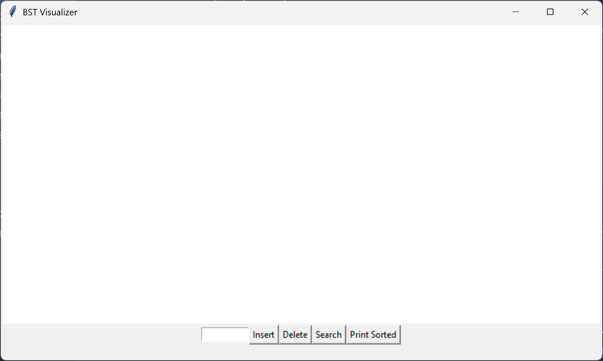
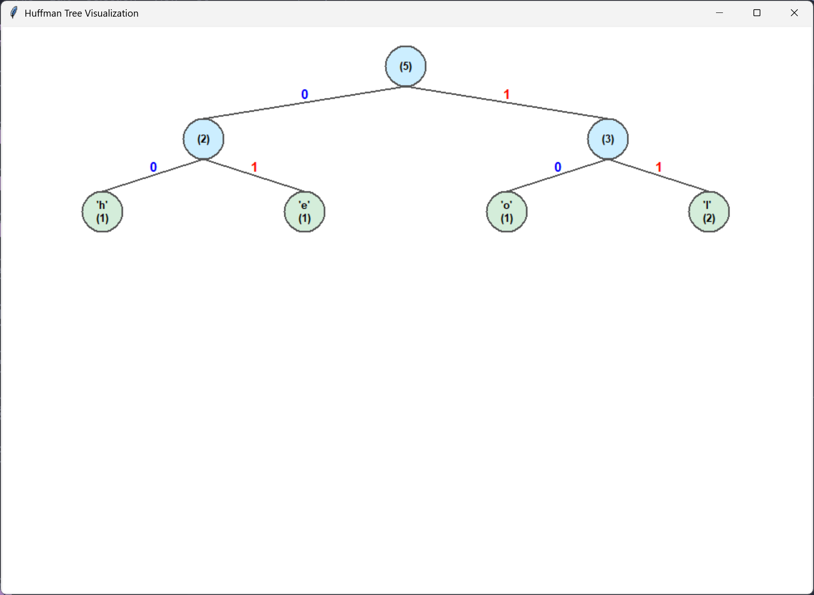

# CSC2103: Data Structures and Algorithms Group Assignment

A simple CLI program that demonstrates three distinct problem solutions, each with its own independent Python script.

1. Binary Search Tree (Insert, Search, Delete, Traversal(In-Order))
2. Lossless Compression (Huffman Coding Algorithm)
3. Dynamic Programming (Coin Change Problem)


## 1. Binary Search Tree

- Displays a GUI with Tkinter: including a canvas to visualize the tree, and a control panel for various operations.

- Contains a canvas for tree visualization, and a control panel to carry out various tree operations.


## 2. Huffman Coding

- Contains a functional console program, and visualization of huffman tree (w/ Tkinter).
- CLI Options: 
    - run predefined test cases
    - run encoding for custom input
    - exit
Initial output:
```
╔══════════════════════════════╗
║   Huffman Coding Toolkit     ║
╚══════════════════════════════╝
1. Run Predefined Test Cases
2. Encode Custom Text
3. Exit
Enter your choice:
```

Option '2' is chosen, with input of 'hello:
```
--- Output Configuration ---
Show Huffman table? (y/n): y
Show full encoding/decoding results? (y/n): y
Show compression analysis? (y/n): y
Generate tree visualization? (y/n): y

Enter text to encode: hello

╔═══════════════════════════════╗
║   Huffman Coding Analysis     ║
╚═══════════════════════════════╝

--- Character Frequencies & Codes ---

┌────────┬──────┬──────┐
│ Char   │ Freq │ Code │
├────────┼──────┼──────┤
│ 'e'    │ 1    │ 01   │
│ 'h'    │ 1    │ 00   │
│ 'l'    │ 2    │ 11   │
│ 'o'    │ 1    │ 10   │
└────────┴──────┴──────┘

--- Encoding & Decoding Results ---

Original String:  hello
Encoded String:   0001111110
Decoded String:   hello

--- Compression Analysis ---

Original Size:    40 bits (5 chars x 8 bits)
Encoded Size:     10 bits
Space Savings:    75.00%

────────────────────────────────────────
✅ Verification: SUCCESS! Original and decoded strings match.
────────────────────────────────────────

Launching visualization window...
```




## 3. Coin Change Problem

WIP (needs user input, test cases, formatted console output)


## Run Locally

Clone the project and open its directory

```bash
  git clone https://github.com/Qyang04/Self-Project dsa
  cd dsa
```

Install dependencies and run script(s)

```bash
  pip install tkinter
  python <bst.py/huffman_encoder.py/coin_changer.py>
```


## Technologies

- Python 3
- Tkinter (for visualization)


## License

[MIT](LICENSE)

